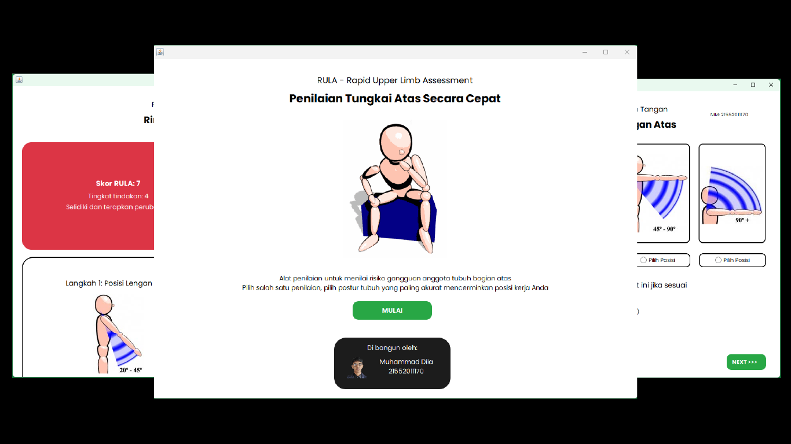

# RULA - Rapid Upper Limb Assessment


Aplikasi perhitungan RULA (Rapid Upper Limb Assessment) menggunakan Java berbasis GUI sebagai 
solusi untuk meningkatkan ergonomi dan kenyamanan kerja pada industri dan perusahaan.

## Preview



## Database

Buat database terlebih dahulu dengan nama:
```bash
db_rula
```
Kemudian import database. Atau database telah di sediakan di dalam source code, dapat di lihat di:
[db_rula.sql](1.PETING!!/Database/db_rula.sql)

## Font

Pastikan device anda telah terinstall font Poppins, yang telah di sediakan di dalam source code nya, dapat dilihat di:
[Font - Poppins](1.PETING!!/Font/)
